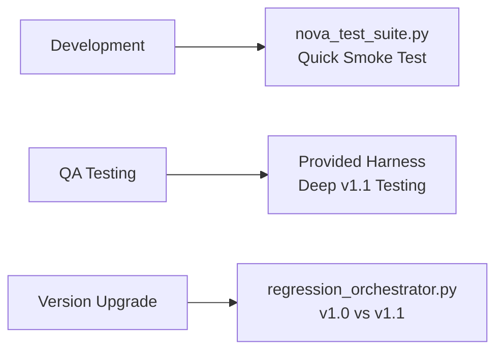

# Test Suite Quick Reference

## At a Glance

You have **3 test suites** in your workspace:

| Test Suite                     | Location             | Purpose                 | When to Use                  |
| ------------------------------ | -------------------- | ----------------------- | ---------------------------- |
| **nova_test_suite.py**         | `/` (root)           | Quick smoke testing     | Daily development, PR checks |
| **regression_orchestrator.py** | `/regression_tests/` | v1.0 vs v1.1 comparison | Major version upgrades       |
| **Provided harness**           | (not yet added)      | Deep v1.1 validation    | Comprehensive testing        |

## Key Differences

### Your `nova_test_suite.py`

- ✅ **Pros**: Simple, self-contained, auto-setup
- ❌ **Cons**: Only 4 test scenarios, no edge cases
- 📊 **Output**: Basic MD + JSON reports

### Your `regression_orchestrator.py`

- ✅ **Pros**: Compares versions, extensive YAML config
- ❌ **Cons**: Complex setup, needs both v1.0 and v1.1
- 📊 **Output**: MD + JSON + comparison charts

### Provided Regression Harness

- ✅ **Pros**: 6 edge cases, unfixable bugs, no-op patches
- ✅ **Pros**: Works standalone OR with YAML config
- ✅ **Pros**: Better iteration/patch counting
- 📊 **Output**: Professional tables + MD + JSON

## What the Provided Harness Adds

### Unique Test Scenarios

1. **Unfixable bug** - Code is right, test is wrong
2. **No-op patch** - Test that always fails
3. **Off-by-one** - Common bug pattern

### Better Analysis

- Counts patches in `.nova/*/diffs/*.patch`
- Detects exit reasons (timeout vs max iterations)
- Professional table formatting with dynamic widths

### Cleaner Implementation

```python
# Isolated test runs
with tempfile.TemporaryDirectory() as tmpdir:
    # Each test gets fresh copy
```

## Quick Start with Provided Harness

```bash
# Save to your regression_tests directory
cp nova_regression_test.py regression_tests/

# Run with built-in tests
python regression_tests/nova_regression_test.py --generate

# Or use your existing YAML
python regression_tests/nova_regression_test.py \
  --config regression_tests/test_repos.yaml
```

## Recommendation

**Keep all three** - they serve different purposes:



## Integration Opportunities

Consider adding to your `nova_test_suite.py`:

- ✨ Unfixable bug scenarios from provided harness
- ✨ Better regex for iteration counting
- ✨ Optional YAML config support
- ✨ `--generate` flag for test repo creation
