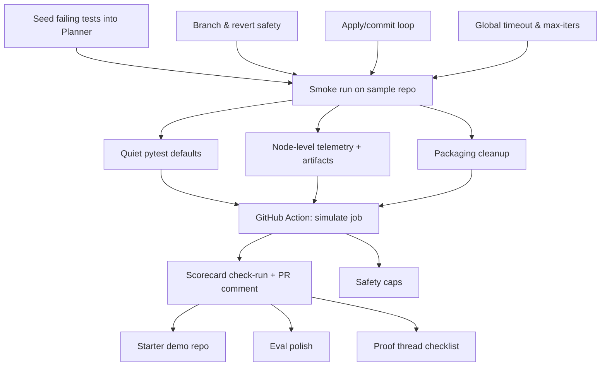

# Nova CI-Rescue — Task Dependency Graph

## How to read it:
- Top-to-bottom flow shows dependencies between tasks.
- A5 (smoke run) is the gate to start CI polish work.
- CI polish (B1/B2/B3) feeds into Action job (C1).
- PR comment (C2) unlocks demo repo and proof generation.
