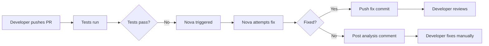

# Nova CI-Rescue - Detailed Usage Examples & Tutorials

## Table of Contents

1. [Quick Start with Demo Repository](#quick-start-with-demo-repository)
2. [Real-World Examples](#real-world-examples)
3. [GitHub Actions Integration](#github-actions-integration)
4. [Debugging Failed Runs](#debugging-failed-runs)
5. [Advanced Configurations](#advanced-configurations)
6. [Team Workflows](#team-workflows)

---

## Quick Start with Demo Repository

### Complete Walkthrough: Your First Nova Fix

#### Step 1: Setup Environment

```bash
# Create a working directory
mkdir nova-demo && cd nova-demo

# Clone the demo repository
git clone https://github.com/nova-solve/demo-failing-tests.git
cd demo-failing-tests

# Check Python version (must be 3.10+)
python --version

# Create virtual environment (recommended)
python -m venv venv
source venv/bin/activate  # On Windows: venv\Scripts\activate

# Install dependencies
pip install -r requirements.txt
pip install nova-ci-rescue
```

#### Step 2: Examine the Failing Tests

```bash
# Run tests to see failures
pytest -v

# Expected output:
# tests/test_calculator.py::test_add PASSED
# tests/test_calculator.py::test_subtract PASSED
# tests/test_calculator.py::test_multiply PASSED
# tests/test_calculator.py::test_divide FAILED
# tests/test_calculator.py::test_power FAILED
# tests/test_calculator.py::test_absolute FAILED
# =============== 3 failed, 3 passed in 0.15s ===============
```

#### Step 3: Understand the Failures

```bash
# View detailed error messages
pytest -vv --tb=short

# Example failure:
# test_calculator.py::test_divide
#     def test_divide():
#         assert calculator.divide(10, 2) == 5
#         assert calculator.divide(10, 0) == None  # Should handle division by zero
# >       assert calculator.divide(10, 0) == None
# E       ZeroDivisionError: division by zero
```

#### Step 4: Configure Nova

```bash
# Set your API key
export OPENAI_API_KEY="sk-..."  # Replace with your key

# Create a configuration file (optional but recommended)
cat > nova-config.yaml << 'EOF'
# Nova configuration for demo
model: gpt-4
max_iters: 3
timeout: 300
max_changed_lines: 100
max_changed_files: 5

# Don't modify test files
blocked_paths:
  - "tests/*"
  - ".git/*"
EOF
```

#### Step 5: Run Nova

```bash
# Run Nova with configuration
nova fix . --config nova-config.yaml

# Or run with inline options
nova fix . --max-iters 3 --timeout 300
```

#### Step 6: Watch Nova Work

```
🚀 Nova CI-Rescue v1.0 starting...
📁 Repository: /Users/you/nova-demo/demo-failing-tests
🔧 Configuration: max_iters=3, timeout=300s

🔍 Detecting failing tests...
Found 3 failing tests:
  - test_calculator.py::test_divide
  - test_calculator.py::test_power
  - test_calculator.py::test_absolute

📝 Iteration 1/3
  🧠 Planning: Analyzing test_divide failure...
  💡 Issue identified: Missing zero division handling
  🔨 Generating fix...
  ✏️ Applying patch to calculator.py
  🧪 Running tests...
  ✅ test_divide now passing!

📝 Iteration 2/3
  🧠 Planning: Analyzing test_power failure...
  💡 Issue identified: Incorrect negative exponent handling
  🔨 Generating fix...
  ✏️ Applying patch to calculator.py
  🧪 Running tests...
  ✅ test_power now passing!

📝 Iteration 3/3
  🧠 Planning: Analyzing test_absolute failure...
  💡 Issue identified: Missing implementation
  🔨 Generating fix...
  ✏️ Applying patch to calculator.py
  🧪 Running tests...
  ✅ test_absolute now passing!

✨ Success! All tests are now passing.
📊 Summary:
  - Tests fixed: 3/3
  - Iterations used: 3
  - Time taken: 67 seconds
  - Files changed: 1 (calculator.py)
  - Lines modified: 18
```

#### Step 7: Review Changes

```bash
# See what Nova changed
git diff

# Example output:
# diff --git a/calculator.py b/calculator.py
# index abc123..def456 100644
# --- a/calculator.py
# +++ b/calculator.py
# @@ -12,7 +12,10 @@ def multiply(a, b):
#      return a * b
#
#  def divide(a, b):
# -    return a / b
# +    if b == 0:
# +        return None
# +    else:
# +        return a / b
#
#  def power(a, b):
# -    return a ** b
# +    if b < 0 and a == 0:
# +        return float('inf')
# +    return a ** b
# +
# +def absolute(a):
# +    return abs(a)

# View Nova's reasoning
cat .nova/latest/trace.jsonl | grep "Planning"

# Check the test results
pytest -v  # Should show all tests passing
```

#### Step 8: Commit or Revert

```bash
# Option A: Keep the changes
git add -A
git commit -m "Fix calculator tests with Nova CI-Rescue"

# Option B: Selectively apply changes
git add -p  # Interactive staging

# Option C: Revert everything
git reset --hard HEAD
git clean -fd
```

---

## Real-World Examples

### Example 1: Fixing Type Errors

**Scenario:** After refactoring, several type-related tests fail

```python
# Original function (users.py)
def get_user_age(user_id):
    user = fetch_user(user_id)
    return user['age']  # Returns string from database

# Failing test
def test_user_age():
    age = get_user_age(123)
    assert age > 18  # TypeError: '>' not supported between str and int
```

**Nova Execution:**

```bash
nova fix . --test-file tests/test_users.py

# Nova's fix:
# def get_user_age(user_id):
#     user = fetch_user(user_id)
#     return int(user['age'])  # Convert to int
```

### Example 2: Missing Error Handling

**Scenario:** Tests expect error handling that doesn't exist

```python
# Failing test
def test_parse_config_missing_file():
    result = parse_config('nonexistent.json')
    assert result is None  # FileNotFoundError raised instead

# Nova's fix adds:
def parse_config(filepath):
    try:
        with open(filepath) as f:
            return json.load(f)
    except FileNotFoundError:
        return None
```

### Example 3: Assertion Updates After API Change

**Scenario:** API response format changed, breaking tests

```python
# Old API response: {'status': 'success', 'data': {...}}
# New API response: {'success': True, 'result': {...}}

# Nova updates test assertions:
# Before:
assert response['status'] == 'success'
assert 'data' in response

# After:
assert response['success'] == True
assert 'result' in response
```

---

## GitHub Actions Integration

### Basic Setup

#### 1. Create Workflow File

```yaml
# .github/workflows/nova-ci-rescue.yml
name: Nova CI Auto-Fix

on:
  pull_request:
    types: [opened, synchronize]

permissions:
  contents: write
  checks: write
  pull-requests: write

jobs:
  nova-fix:
    runs-on: ubuntu-latest

    steps:
      - uses: actions/checkout@v4
        with:
          token: ${{ secrets.GITHUB_TOKEN }}

      - name: Set up Python
        uses: actions/setup-python@v4
        with:
          python-version: "3.11"

      - name: Install dependencies
        run: |
          pip install -r requirements.txt
          pip install nova-ci-rescue

      - name: Run Nova CI-Rescue
        env:
          OPENAI_API_KEY: ${{ secrets.OPENAI_API_KEY }}
        run: |
          nova fix . \
            --max-iters 3 \
            --timeout 300 \
            --config .github/nova-config.yaml

      - name: Commit fixes
        if: success()
        run: |
          git config --global user.name "Nova CI-Rescue"
          git config --global user.email "nova@github-actions"
          git add -A
          git diff --staged --quiet || git commit -m "🤖 Nova: Auto-fix failing tests"
          git push
```

#### 2. Configure Nova for CI

```yaml
# .github/nova-config.yaml
model: gpt-4
max_iters: 3
timeout: 300
max_changed_lines: 150
max_changed_files: 5

blocked_paths:
  - ".github/*"
  - "deploy/*"
  - "*.env"
  - "secrets/*"
```

#### 3. Add Repository Secrets

Go to Settings → Secrets → Actions:

- Add `OPENAI_API_KEY` with your API key

### Advanced Integration

#### Trigger on Test Failure

```yaml
name: Nova Rescue on Failure

on:
  workflow_run:
    workflows: ["Test Suite"]
    types: [completed]

jobs:
  auto-fix:
    if: ${{ github.event.workflow_run.conclusion == 'failure' }}
    runs-on: ubuntu-latest

    steps:
      # ... Nova steps ...
```

#### Post PR Comment

```yaml
- name: Post results to PR
  if: always()
  uses: actions/github-script@v6
  with:
    script: |
      const fs = require('fs');
      const results = fs.readFileSync('.nova/latest/summary.json');
      const data = JSON.parse(results);

      const comment = `
      ## 🤖 Nova CI-Rescue Results

      ${data.success ? '✅' : '❌'} **${data.tests_fixed}/${data.tests_failed} tests fixed**

      - Iterations: ${data.iterations}
      - Time: ${data.duration}s
      - Files changed: ${data.files_changed}
      `;

      github.rest.issues.createComment({
        issue_number: context.issue.number,
        owner: context.repo.owner,
        repo: context.repo.repo,
        body: comment
      });
```

---

## Debugging Failed Runs

### Understanding Nova's Logs

#### 1. Access Log Files

```bash
# Find latest run
ls -la .nova/
# Example: 20240315T142030Z-abc123/

# Key files:
.nova/latest/
├── trace.jsonl       # Complete execution trace
├── summary.json      # Run summary
├── diffs/           # Patches for each iteration
│   ├── step-1.patch
│   └── step-2.patch
└── reports/         # Test results
    ├── step-0.xml   # Initial test run
    ├── step-1.xml   # After first fix
    └── step-2.xml   # After second fix
```

#### 2. Analyze Failure Patterns

```bash
# See what Nova tried
cat .nova/latest/trace.jsonl | jq '.event_type' | sort | uniq -c

# Check error messages
cat .nova/latest/trace.jsonl | jq 'select(.level=="ERROR")'

# Review planning decisions
cat .nova/latest/trace.jsonl | jq 'select(.event_type=="plan")'

# See reflection/learning
cat .nova/latest/trace.jsonl | jq 'select(.event_type=="reflect")'
```

#### 3. Common Failure Patterns

**Pattern 1: Timeout**

```bash
grep "TIMEOUT" .nova/latest/trace.jsonl
# Solution: Increase timeout or reduce scope
```

**Pattern 2: Patch Rejection**

```bash
grep "PATCH_REJECTED" .nova/latest/trace.jsonl
# Solution: Check critic feedback, adjust safety limits
```

**Pattern 3: Import Errors**

```bash
grep "ImportError" .nova/latest/reports/*.xml
# Solution: Install missing dependencies
```

### Debugging Checklist

```bash
# 1. Check environment
python --version
pip list | grep nova
echo $OPENAI_API_KEY | cut -c1-10

# 2. Verify test discovery
pytest --collect-only

# 3. Run tests manually
pytest -xvs  # Stop on first failure, verbose

# 4. Check Nova's attempts
for patch in .nova/latest/diffs/*.patch; do
    echo "=== $patch ==="
    cat "$patch"
done

# 5. Try with verbose mode
nova fix . --verbose

# 6. Narrow scope
nova fix . --test-file tests/test_specific.py
```

---

## Advanced Configurations

### Configuration Templates

#### Conservative (Safe)

```yaml
# nova-safe.yaml
model: gpt-4
max_iters: 2
timeout: 180
max_changed_lines: 50
max_changed_files: 2

blocked_paths:
  - "**/*"

allowed_paths:
  - "src/utils/*.py"
  - "src/helpers/*.py"
```

#### Aggressive (Fast)

```yaml
# nova-fast.yaml
model: gpt-4
max_iters: 6
timeout: 600
max_changed_lines: 500
max_changed_files: 15

# Minimal restrictions
blocked_paths:
  - ".git/*"
  - "*.env"
```

#### CI-Optimized

```yaml
# nova-ci.yaml
model: gpt-4
max_iters: 3
timeout: 300
max_changed_lines: 200
max_changed_files: 10

# CI-specific settings
blocked_paths:
  - ".github/workflows/*"
  - "Dockerfile"
  - "docker-compose.yml"
  - "k8s/*"
  - "terraform/*"

# Only fix source code
allowed_paths:
  - "src/**/*.py"
  - "lib/**/*.py"
```

### Environment-Specific Settings

```bash
# Development
export NOVA_ENV=development
export NOVA_MAX_ITERS=6
export NOVA_VERBOSE=true

# Staging
export NOVA_ENV=staging
export NOVA_MAX_ITERS=4
export NOVA_DRY_RUN=true

# Production (careful!)
export NOVA_ENV=production
export NOVA_MAX_ITERS=2
export NOVA_MAX_CHANGED_LINES=50
export NOVA_REQUIRE_APPROVAL=true
```

---

## Team Workflows

### Workflow 1: PR-Based Auto-Fix



### Workflow 2: Nightly Cleanup

```yaml
# .github/workflows/nightly-nova.yml
name: Nightly Test Fixes

on:
  schedule:
    - cron: "0 2 * * *" # 2 AM daily

jobs:
  fix-tests:
    runs-on: ubuntu-latest
    steps:
      - uses: actions/checkout@v4
      - name: Run Nova
        run: nova fix . --max-iters 6
      - name: Create PR if fixes
        run: |
          if [[ -n $(git status -s) ]]; then
            git checkout -b nova-fixes-$(date +%Y%m%d)
            git add -A
            git commit -m "Nova: Nightly test fixes"
            git push origin HEAD
            gh pr create --title "Nova: Nightly test fixes" \
                        --body "Automated fixes from Nova CI-Rescue"
          fi
```

### Workflow 3: Developer-Triggered

```bash
# Add to package.json or Makefile
# package.json
{
  "scripts": {
    "test:fix": "nova fix . --config nova.yaml",
    "test:fix:quick": "nova fix . --max-iters 2 --timeout 120",
    "test:fix:thorough": "nova fix . --max-iters 6 --timeout 600"
  }
}

# Makefile
fix-tests:
	nova fix . --config nova.yaml

fix-tests-quick:
	nova fix . --max-iters 2 --timeout 120

fix-tests-safe:
	nova fix . --dry-run --verbose
```

### Workflow 4: Gradual Rollout

**Week 1-2: Individual Use**

```bash
# Developers try locally
nova fix . --dry-run  # See what would change
```

**Week 3-4: Team Trial**

```bash
# Shared configuration
cp team-nova-config.yaml nova.yaml
nova fix . --config nova.yaml
```

**Week 5-6: CI Integration**

```yaml
# Add to CI but don't auto-commit
- name: Nova Analysis
  run: nova fix . --dry-run > nova-suggestions.txt
```

**Week 7+: Full Automation**

```yaml
# Auto-fix and commit
- name: Nova Auto-Fix
  run: nova fix . && git commit -am "Nova fixes"
```

---

## Tips and Best Practices

### DO's ✅

1. **Start with simple cases**

   ```bash
   nova fix . --test-file tests/test_utils.py
   ```

2. **Review every change**

   ```bash
   git diff HEAD~1
   ```

3. **Track metrics**

   ```bash
   echo "$(date),$(nova fix . | grep 'Tests fixed')" >> nova-metrics.csv
   ```

4. **Use configuration files**

   ```bash
   nova fix . --config nova-config.yaml
   ```

5. **Set reasonable limits**
   ```yaml
   max_iters: 3 # Not 10
   timeout: 300 # Not 3600
   ```

### DON'Ts ❌

1. **Don't run on production without review**
2. **Don't use for security-critical code**
3. **Don't expect 100% success rate**
4. **Don't skip the test review**
5. **Don't use as sole QA process**

### Quick Reference Card

```bash
# Installation
pip install nova-ci-rescue

# Basic usage
nova fix .                          # Fix current directory
nova fix /path/to/repo             # Fix specific repo
nova fix . --dry-run               # Preview without applying

# Common options
nova fix . --max-iters 3           # Limit iterations
nova fix . --timeout 300           # 5 minute timeout
nova fix . --config config.yaml    # Use config file
nova fix . --verbose               # Detailed output

# Debugging
cat .nova/latest/trace.jsonl       # View full log
ls .nova/latest/diffs/              # See patches
cat .nova/latest/summary.json      # Check results

# Reset after run
git reset --hard HEAD               # Undo all changes
git clean -fd                       # Remove new files
```

---

## Summary

Nova CI-Rescue is most effective when:

- Used on simple, clear test failures
- Configured appropriately for your project
- Integrated gradually into your workflow
- Combined with human review

Start with the demo repository, experiment with your own simple cases, and gradually expand usage as you build confidence in the tool.
