# Nova CI-Rescue - Visual Assets Documentation

## Overview

This document provides templates, specifications, and guidelines for creating visual assets for Nova CI-Rescue, including screenshots, diagrams, and marketing materials.

## Required Visual Assets

### Priority 1: Essential (Must Have)

1. **Hero Screenshot** - Nova fixing tests in terminal
2. **PR Comment Scorecard** - GitHub PR with Nova's results
3. **Architecture Diagram** - How Nova works
4. **Before/After Comparison** - Test results transformation

### Priority 2: Important (Should Have)

5. **Workflow Diagram** - Nova's agent loop
6. **Installation GIF** - Quick setup animation
7. **Configuration Example** - YAML with annotations
8. **Error Message Examples** - Improved UX showcase

### Priority 3: Nice to Have

9. **Integration Diagram** - CI/CD pipeline integration
10. **Metrics Dashboard** - Success rates visualization
11. **Team Workflow** - Collaboration diagram
12. **Feature Comparison Table** - Nova vs alternatives

## Asset Specifications

### 1. Hero Screenshot - Terminal Success

**File:** `docs/assets/nova-hero-terminal.png`

```bash
# Terminal content to capture:
$ nova fix .
🚀 Nova CI-Rescue v1.0 starting...
📋 Found 3 failing tests

Iteration 1/3:
  🧠 Planning fix for test_calculator.py::test_division
  💡 Identified issue: Missing zero division check
  🔧 Applying patch to calculator.py
  ✅ test_calculator.py::test_division now passing!

Iteration 2/3:
  🧠 Planning fix for test_calculator.py::test_power
  💡 Identified issue: Incorrect negative exponent handling
  🔧 Applying patch to calculator.py
  ✅ test_calculator.py::test_power now passing!

✨ All tests fixed successfully!
📈 Metrics: 2 iterations | 42 seconds | 1 file changed | 15 lines modified
```

**Specifications:**

- Terminal: Dark theme (preferably VS Code integrated terminal or iTerm2)
- Font: JetBrains Mono or Fira Code
- Size: 1200x800px
- Background: Dark (#1e1e1e)
- Include colorful output (green checks, blue info, etc.)

### 2. PR Comment Scorecard

**File:** `docs/assets/pr-comment-scorecard.png`

**Mock Content:**

```markdown
## 🤖 Nova CI-Rescue Results

✅ **Successfully fixed 3/3 failing tests**

### 📊 Performance Metrics

| Metric         | Value | Status       |
| -------------- | ----- | ------------ |
| Tests Fixed    | 3/3   | ✅ 100%      |
| Iterations     | 2     | ⚡ Efficient |
| Time Taken     | 42s   | ⚡ Fast      |
| Files Changed  | 1     | ✅ Minimal   |
| Lines Modified | 15    | ✅ Safe      |
| Model Used     | gpt-4 | -            |
| Estimated Cost | $0.08 | 💰           |

### 🔧 Changes Summary

<details>
<summary>View detailed changes</summary>

**calculator.py**

- Added zero division check (line 45)
- Fixed negative exponent handling (line 67)
- Added input validation (line 23)

</details>

### 📝 Commit Details

- Branch: `nova-fix-20240315-142330`
- Commit: `a7b9c2d` Fix failing calculator tests
- Author: Nova CI-Rescue Bot

---

_Generated by [Nova CI-Rescue](https://nova.ai) v1.0 • [Documentation](https://docs.nova.ai)_
```

**Specifications:**

- Context: GitHub PR comment
- Width: 900px
- Show GitHub UI elements (avatar, timestamp, reactions)
- Professional formatting with tables and expandable sections

### 3. Architecture Diagram

**File:** `docs/assets/nova-architecture.svg`

```mermaid
graph TB
    subgraph "Input"
        A[Failing Tests] --> B[Nova CI-Rescue]
    end

    subgraph "Nova Agent Loop"
        B --> C[1. Planner]
        C --> D[2. Actor/Coder]
        D --> E[3. Critic]
        E --> F[4. Apply Patch]
        F --> G[5. Run Tests]
        G --> H{Tests Pass?}
        H -->|No| I[6. Reflect]
        I --> C
        H -->|Yes| J[Success]
    end

    subgraph "Output"
        J --> K[✅ Green Tests]
        J --> L[📊 Metrics Report]
        J --> M[🔧 Git Commits]
    end

    style A fill:#ff6b6b
    style K fill:#51cf66
    style L fill:#339af0
    style M fill:#845ef7
```



**Specifications:**

- Format: SVG (vector)
- Style: Clean, modern, with Nova brand colors
- Dimensions: 1200x600px
- Include icons and color coding

### 4. Before/After Comparison

**File:** `docs/assets/before-after-tests.png`

**Layout:** Split screen showing:

**BEFORE (Left side):**

```bash
$ pytest
======================== test session starts ========================
tests/test_calculator.py::test_add PASSED                    [ 33%]
tests/test_calculator.py::test_subtract PASSED               [ 66%]
tests/test_calculator.py::test_divide FAILED                 [100%]
tests/test_calculator.py::test_power FAILED                  [100%]
tests/test_calculator.py::test_absolute FAILED               [100%]

====================== 3 failed, 2 passed in 0.15s ==================
```

**AFTER (Right side):**

```bash
$ pytest
======================== test session starts ========================
tests/test_calculator.py::test_add PASSED                    [ 20%]
tests/test_calculator.py::test_subtract PASSED               [ 40%]
tests/test_calculator.py::test_divide PASSED                 [ 60%]
tests/test_calculator.py::test_power PASSED                  [ 80%]
tests/test_calculator.py::test_absolute PASSED               [100%]

====================== 5 passed in 0.12s ============================
```

**Specifications:**

- Two terminal windows side by side
- Red highlighting for failures, green for success
- Clear "BEFORE" and "AFTER" labels
- Size: 1400x600px

### 5. Workflow Animation GIF

**File:** `docs/assets/nova-workflow.gif`

**Storyboard (5-10 seconds):**

1. Frame 1: Red failing tests appear
2. Frame 2: User types `nova fix .`
3. Frame 3: Nova analyzes (show spinner)
4. Frame 4: "Applying fix..." message
5. Frame 5: Tests re-run
6. Frame 6: All green checkmarks
7. Frame 7: Success message with metrics

**Specifications:**

- Duration: 8-10 seconds
- Loop: Yes
- FPS: 10-15
- Size: 800x600px
- Optimize for web (<2MB)

## Marketing Visual Assets

### Social Media Cards

**Twitter/X Card** (1200x675px)

```
┌─────────────────────────────────────┐
│                                     │
│     🚀 Nova CI-Rescue              │
│                                     │
│   Turn Red Tests Green in Seconds  │
│                                     │
│   [Terminal showing success]        │
│                                     │
│   ✅ 85% Success Rate              │
│   ⚡ 42 Second Average Fix         │
│   🔒 Safe & Reviewable             │
│                                     │
└─────────────────────────────────────┘
```

### Product Hunt Banner

**Dimensions:** 1270x760px

**Content:**

- Tagline: "AI That Fixes Your Failing Tests"
- 3 key features with icons
- Screenshot of terminal success
- Call-to-action: "Try Free"

### README Header Banner

**File:** `docs/assets/readme-banner.png`

```
╔══════════════════════════════════════════════════════════╗
║                    Nova CI-Rescue                         ║
║         AI-Powered Automated Test Fixing                  ║
║                                                           ║
║  [Failed] ──→ [Nova Magic] ──→ [Success]                ║
║     ❌             🤖              ✅                    ║
╚══════════════════════════════════════════════════════════╝
```

**Specifications:**

- Width: 100% (responsive)
- Height: 200-300px
- Include logo, tagline, and visual flow

## Diagram Templates

### Simple Flow Diagram

```
Tests Fail → Nova Analyzes → Generates Fix → Applies Patch → Tests Pass
    ❌           🔍              💡             🔧            ✅
```

### Iteration Loop Diagram

```
        ┌─────────────┐
        │   START     │
        └──────┬──────┘
               ↓
        ┌─────────────┐
        │ Read Errors │←─────┐
        └──────┬──────┘      │
               ↓             │
        ┌─────────────┐      │
        │ Plan Fix    │      │
        └──────┬──────┘      │
               ↓             │
        ┌─────────────┐      │
        │ Write Code  │      │
        └──────┬──────┘      │
               ↓             │
        ┌─────────────┐      │
        │ Run Tests   │      │
        └──────┬──────┘      │
               ↓             │
           [Pass?]───No──────┘
               │
              Yes
               ↓
        ┌─────────────┐
        │   SUCCESS   │
        └─────────────┘
```

### Integration Ecosystem

```
         GitHub
            ↓
    ┌───────────────┐
    │  Pull Request │
    └───────┬───────┘
            ↓
    ┌───────────────┐
    │   CI Pipeline │
    └───────┬───────┘
            ↓
        [Tests Fail]
            ↓
    ┌───────────────┐
    │     Nova      │
    └───────┬───────┘
            ↓
        [Fix Tests]
            ↓
    ┌───────────────┐
    │  Push Commit  │
    └───────┬───────┘
            ↓
    ┌───────────────┐
    │  PR Comment   │
    └───────────────┘
```

## Screenshot Creation Guide

### Terminal Setup

```bash
# Install required fonts
brew install --cask font-jetbrains-mono

# Configure terminal
# iTerm2: Preferences → Profiles → Colors → "Snazzy" theme
# VS Code: Settings → Terminal → Font Family → "JetBrains Mono"

# Set terminal size
printf '\e[8;30;120t'  # 30 rows, 120 columns
```

### Capture Commands

```bash
# macOS
cmd+shift+4  # Select area
cmd+shift+5  # Screen recording for GIFs

# Linux
gnome-screenshot -a  # Area selection
peek  # For GIF recording

# Windows
Win+Shift+S  # Snip tool
ScreenToGif  # For GIF recording
```

### Post-Processing

```bash
# Optimize PNG
pngquant --quality=85-95 screenshot.png

# Create GIF from video
ffmpeg -i video.mov -vf "fps=10,scale=800:-1" -c:v gif output.gif

# Optimize GIF
gifsicle -O3 --colors 256 input.gif > output.gif
```

## Asset Checklist

### Before Release

- [ ] Hero terminal screenshot
- [ ] PR comment scorecard
- [ ] Architecture diagram
- [ ] Before/after comparison
- [ ] Installation GIF
- [ ] README banner
- [ ] Social media cards

### Marketing Materials

- [ ] Product Hunt assets
- [ ] Twitter/X announcement graphics
- [ ] Blog post illustrations
- [ ] Demo video thumbnail
- [ ] Presentation slides template

### Documentation

- [ ] Workflow diagrams
- [ ] Configuration examples
- [ ] Error message examples
- [ ] Integration diagrams

## Color Palette

```css
/* Nova Brand Colors */
--nova-primary: #5b5fc7; /* Purple */
--nova-success: #10b981; /* Green */
--nova-error: #ef4444; /* Red */
--nova-warning: #f59e0b; /* Amber */
--nova-info: #3b82f6; /* Blue */
--nova-dark: #1f2937; /* Dark Gray */
--nova-light: #f9fafb; /* Light Gray */

/* Terminal Colors */
--term-bg: #1e1e1e;
--term-fg: #d4d4d4;
--term-green: #4ec9b0;
--term-red: #f48771;
--term-yellow: #dcdcaa;
--term-blue: #569cd6;
```

## File Organization

```
docs/
└── assets/
    ├── screenshots/
    │   ├── nova-hero-terminal.png
    │   ├── pr-comment-scorecard.png
    │   ├── before-after-tests.png
    │   └── error-examples/
    │       ├── api-key-error.png
    │       ├── timeout-error.png
    │       └── safety-limit.png
    ├── diagrams/
    │   ├── architecture.svg
    │   ├── workflow.svg
    │   ├── integration.svg
    │   └── agent-loop.svg
    ├── gifs/
    │   ├── installation.gif
    │   ├── nova-workflow.gif
    │   └── quick-fix-demo.gif
    └── marketing/
        ├── social-cards/
        ├── banners/
        └── presentations/
```

## Usage Guidelines

1. **Consistency**: Use the same terminal theme and font across all screenshots
2. **Clarity**: Ensure text is readable at typical viewing sizes
3. **Branding**: Include Nova logo/name where appropriate
4. **Accessibility**: Provide alt text for all images
5. **Optimization**: Compress images for web use
6. **Updates**: Re-capture screenshots when UI changes significantly

## Tools and Resources

### Design Tools

- **Figma**: For creating diagrams and marketing materials
- **Excalidraw**: For hand-drawn style diagrams
- **Carbon**: For beautiful code screenshots
- **Mermaid**: For generating flow charts

### Terminal Tools

- **asciinema**: Record terminal sessions
- **termtosvg**: Convert terminal recordings to SVG
- **rich**: Python library for beautiful terminal output

### Image Tools

- **ImageOptim**: Compress images without quality loss
- **SVGO**: Optimize SVG files
- **gifski**: High-quality GIF encoder

## Summary

Visual assets are crucial for Nova CI-Rescue's documentation and marketing. Focus on:

1. Clear, professional screenshots showing success
2. Informative diagrams explaining the workflow
3. Engaging animations demonstrating ease of use
4. Consistent branding and visual language
5. Accessibility and optimization for all platforms
