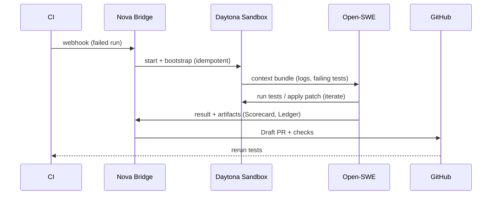

# Nova OS v2 — Architecture

**Goal:** keep repos green by running policy-bound agents in ephemeral sandboxes and shipping proof-backed PRs.

## Components
- **Nova Bridge (intake/orchestrator):** receives CI/webhook/CLI triggers, fetches context, spawns sandboxes.
- **Policy Engine:** loads `OrgSpec` and enforces diff caps, path allow/deny lists, budgets, review gates.
- **Executor (Open-SWE):** triage → fix → verify → explain. Uses repo lockfiles; no network unless allowed.
- **Sandbox (Daytona):** ephemeral VM/container with first-boot bootstrap; all actions logged to **Ledger**.
- **Evidence:** **Scorecard** (human-readable proof) + **Ledger** (append-only JSONL of steps).
- **Integrations:** GitHub App (PRs/checks), optional GH Action for “simulate”, CLI/Editor later.

## CI-Rescue Sequence
1. **Trigger**: failing workflow or “Fix this” command.
2. **Prepare**: clone, hydrate context (logs, JUnit, failing tests, coverage).
3. **Sandbox**: start ephemeral environment; run `first_bootstrap.sh` if needed.
4. **Reproduce**: re-run failing tests; detect flakes.
5. **Localize**: coverage + static analysis to focus candidate files.
6. **Fix Loop**: triage → minimal patch → test → iterate (budgeted).
7. **Policy Checks**: diff caps, allow/deny paths, lint/format, coverage guard.
8. **Deliver**: open **Draft PR** with **Scorecard**; attach **Ledger**; wait for human review.
9. **Close**: on merge, update metrics; on fail, quarantine or handoff.

## Sequence (mermaid)

