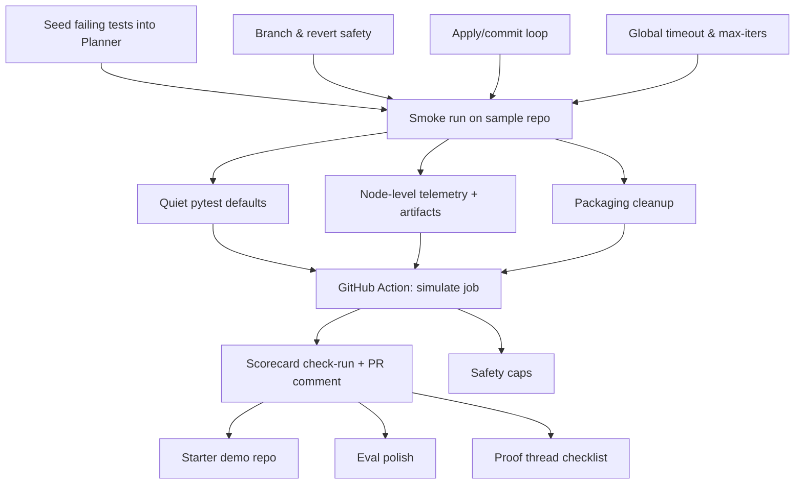

# Nova CI-Rescue — Happy Path Complete Documentation

## 1. Happy Path One-Pager

### Goal
Ship Nova CI-Rescue v1.0 Happy Path — autonomously detect and fix seeded CI test failures end-to-end, producing proof artifacts and a GitHub Action demo.

**Success means:**
- `nova fix` turns a seeded failing repo green locally in ≤ 3 iterations.
- GitHub Action workflow runs successfully, uploads `.nova` artifacts, and posts a Scorecard PR comment.
- Quickstart README lets a new user reproduce the run in ≤ 15 minutes.

### Scope

**In Scope (v1.0):**
- Local CLI (`nova fix`, `nova eval`) flow to green.
- Core agent loop (Planner → Actor → Critic → Apply → RunTests → Reflect).
- Tools: pytest runner, patcher, git tool.
- Telemetry with node-level events and artifacts.
- Quiet pytest defaults for readable logs.
- GitHub Action workflow + PR Scorecard comment.
- Safety caps (LOC, file count, denylist).
- Demo repo with seeded failure.

**Out of Scope (v1.0):**
- Handling multiple complex failure types.
- Multi-repo orchestration.
- Advanced model routing or fallback logic.
- Notifications beyond GitHub (e.g. Slack, email).

### Current Status

**Complete:**
- ✅ CLI commands + branch creation/reset logic.
- ✅ Core agent loop and tools integrated.
- ✅ Timeout & iteration cap enforcement.
- ✅ Basic telemetry skeleton.
- ✅ Dry-run smoke test.

**In Progress:**
- 🔄 Seed failing tests into planner prompt (A1).
- 🔄 Telemetry wiring for all nodes (B2).
- 🔄 Quiet pytest defaults (B1).
- 🔄 Packaging cleanup (B3).

**Not Started:**
- ⏸️ GitHub Action simulate job (C1).
- ⏸️ Scorecard PR comment (C2).
- ⏸️ README Quickstart (B4).
- ⏸️ Starter demo repo (D2).

### Blockers / Risks
- GitHub Action permissions for PR comment on demo repo.
- Model determinism on seeded failure fix.
- Plugin availability (pytest-json-report vs. JUnit XML).

### This Week's Plan
- **Mon:** A1–A3 (seed failing tests, branch/revert safety, apply/commit loop) → A5 smoke run.
- **Tue:** B1 (quiet logs), B2 (telemetry wiring), B3 (packaging cleanup).
- **Wed:** C1 (Action simulate job).
- **Thu:** C2 (Scorecard PR comment), B4 (Quickstart doc).
- **Fri:** End-to-end dry run → Demo + publish proof.

### Definition of Done (v1.0)
- ✅ Local `nova fix` turns seeded repo green.
- ✅ GitHub Action passes with artifacts + PR summary.
- ✅ `.nova/<run>/trace.jsonl`, `diffs/`, `reports/` complete.
- ✅ README Quickstart works for new user.

---

## 2. Architecture Diagram

```mermaid
flowchart TD
    subgraph CLI
        A1["nova fix <repo>"]
        A2["nova eval --repos <file>"]
    end

    subgraph AgentLoop["Agent Loop (LangGraph)"]
        P[Planner]
        Ac[Actor]
        Cr[Critic]
        Ap[ApplyPatch]
        RT[RunTests]
        Rf[Reflect]
    end

    subgraph Tools
        T1[pytest_runner.py]
        T2[patcher.py]
        T3[git_tool.py]
        T4[search.py]
        T5[sandbox.py]
    end

    subgraph LLMServices
        L1[LLMClient<br/>(OpenAI/Anthropic)]
        L2[OpenSWEClient]
    end

    subgraph GitHub
        GH1[Action: nova.yml]
        GH2[Scorecard PR Comment]
        GH3[Artifacts Upload]
    end

    subgraph Telemetry
        Te1[TelemetryRun / JSONLLogger]
        Te2["Artifacts: diffs/, reports/"]
    end

    %% CLI to Agent
    A1 --> P
    A2 --> P

    %% Agent loop flow
    P --> Ac
    Ac --> Cr
    Cr --> Ap
    Ap --> RT
    RT --> Rf
    Rf --> P

    %% Tools integration
    Ap --> T2
    Ap --> T3
    RT --> T1
    Ac --> L1
    Ac --> L2

    %% Telemetry integration
    P --> Te1
    Ac --> Te1
    Cr --> Te1
    Ap --> Te1
    RT --> Te1
    Rf --> Te1
    Te1 --> Te2

    %% GitHub integration
    A1 --> GH1
    GH1 --> GH2
    GH1 --> GH3
```

**How to read it:**
- **CLI:** Entry points for local runs and eval batch mode.
- **Agent Loop:** Planner → Actor → Critic → ApplyPatch → RunTests → Reflect.
- **Tools:** Core helpers for test running, patching, git ops, search, sandbox.
- **LLMServices:** GPT-4/Anthropic direct calls, or OpenSWE for autonomous coding.
- **GitHub:** Action workflow, PR comment, artifact upload.
- **Telemetry:** Logs + artifacts saved per run for proof & debugging.

---

## 3. Task Dependency Graph



**How to read it:**
- Top-to-bottom flow shows dependencies between tasks.
- A5 (smoke run) is the gate to start CI polish work.
- CI polish (B1/B2/B3) feeds into Action job (C1).
- PR comment (C2) unlocks demo repo and proof generation.

---

## 4. Milestone Board

### Live Linear View
[Open in Linear – Happy Path by Milestone](https://linear.app/nova-solve/project/ci-rescue-v10-happy-path-536aaf0d73d7)

### Milestone Summary

| Milestone | Key Deliverables | Status |
|-----------|-----------------|---------|
| **A. Local E2E** | CLI seeded failing tests → green on sample repo | In Progress |
| **B. Quiet CI & Telemetry** | Quiet pytest logs, telemetry wiring, packaging cleanup | Not Started |
| **C. GitHub Action & PR Proof** | Action simulate job, Scorecard PR comment, safety caps | Not Started |
| **D. Demo & Release** | Eval polish, starter demo repo, proof checklist | Not Started |

### Issue Breakdown

#### Milestone A - Local E2E (Happy Path)
- **OS-832** - A1 — Seed failing tests into Planner (2h)
- **OS-833** - A2 — Branch & revert safety (1h)
- **OS-834** - A3 — Apply/commit loop (2h)
- **OS-835** - A4 — Global timeout & max-iters (1h)
- **OS-836** - A5 — Smoke run on sample repo (0.5d)

#### Milestone B - Quiet CI & Telemetry
- **OS-837** - B1 — Quiet pytest defaults (30m)
- **OS-838** - B2 — Node-level telemetry + artifacts (0.5d)
- **OS-839** - B3 — Packaging cleanup (1h)
- **OS-840** - B4 — README Quickstart (2h)

#### Milestone C - GitHub Action & PR Proof
- **OS-841** - C1 — GitHub Action: simulate job (0.5d)
- **OS-842** - C2 — Scorecard check-run + PR comment (0.5d)
- **OS-843** - C3 — Safety caps (2h)

#### Milestone D - Demo & Release
- **OS-844** - D1 — nova eval polish (0.5d)
- **OS-845** - D2 — Starter demo repo (0.5d)
- **OS-846** - D3 — Proof thread checklist (1h)

---

## 5. Proof Checklist Template

```yaml
# Proof Checklist — Nova CI-Rescue Happy Path

⏱ Duration:  
🔁 Iterations:  
🧪 Tests Before → After: `X failed / Y passed` → `0 failed / Y+ passed`  
🧩 Files changed / LOC:  
📦 Artifacts path: `.nova/<run>/…`  
✅ Status: **GREEN / FAIL**

Links:
- Action run: 
- PR: 
- Artifacts download: 
- Proof wall entry:
```

---

## 6. Quickstart Draft

### Install
```bash
pip install -e .
```

### Configure
```bash
export OPENAI_API_KEY=...
# or put in .env
```

### Run
```bash
nova fix /path/to/repo --max-iters 3 --timeout 600
```

### Inspect
```bash
tree .nova/<run>/
# diffs/, reports/, trace.jsonl
```

### Reset
```bash
git reset --hard HEAD
```

---

## 7. Risks & Guardrails

### Safety Caps
- ≤200 LOC changed
- ≤10 files modified
- Denylist: `deploy/`, `secrets`, CI config files

### Time/Iteration Limits
- `--timeout`: Maximum runtime in seconds
- `--max-iters`: Maximum fix attempts

### Model Selection
- Default: GPT-4
- OpenSWE for multi-file changes

### Known Risks
- GitHub Action PR comment permissions
- Plugin availability (pytest-json-report)
- Model determinism on seeded failures

---

## 8. Demo Script

1. **Seed failure in demo repo**
   - Clone demo template
   - Verify failing test exists

2. **Push branch to trigger Action or run locally**
   ```bash
   nova fix . --max-iters 3
   ```

3. **Show nova fix output in console**
   - Highlight iteration count
   - Show green test result

4. **Open PR → show Scorecard comment**
   - Point out metrics
   - Show artifacts link

5. **Open .nova/<run> artifacts**
   - Show diff files
   - Show junit reports

6. **Merge PR → green CI badge**

7. **Capture screenshots for proof wall + social**
   - Before/after test results
   - PR comment
   - Green CI badge

---

## 9. Links Index

### Linear
- [Happy Path by Milestone](https://linear.app/nova-solve/project/ci-rescue-v10-happy-path-536aaf0d73d7)
- [Must-Have Tasks](https://linear.app/nova-solve/view/must-have-tasks)
- [Current Cycle](https://linear.app/nova-solve/cycle/current)

### GitHub
- [CI-Auto-Rescue Repository](https://github.com/your-org/ci-auto-rescue)
- [Demo Repository](https://github.com/your-org/nova-demo-repo)
- [Latest Action Runs](https://github.com/your-org/ci-auto-rescue/actions)

### Documentation
- [Proof Wall](link-to-proof-wall)
- [Shared Diagrams](link-to-figma-or-excalidraw)
- [API Documentation](link-to-api-docs)

### External Resources
- [OpenAI Platform](https://platform.openai.com)
- [Anthropic Console](https://console.anthropic.com)
- [pytest Documentation](https://docs.pytest.org)

---

## 10. Team Notes & Updates

### Latest Updates
- [Date] - Linear project created with all 15 issues
- [Date] - Labels applied to all issues (must-have, nice-to-have, functional areas)
- [Date] - All issues assigned to Sebastian Heyneman

### Next Sync
- Review ChatGPT refined version: https://chatgpt.com/c/689cf09e-0be4-832c-8736-6dbe2f74b478

### Key Decisions
- Start with GPT-4o-mini for cost efficiency
- Focus on single-file fixes for v1.0
- Defer multi-repo orchestration to v2.0
