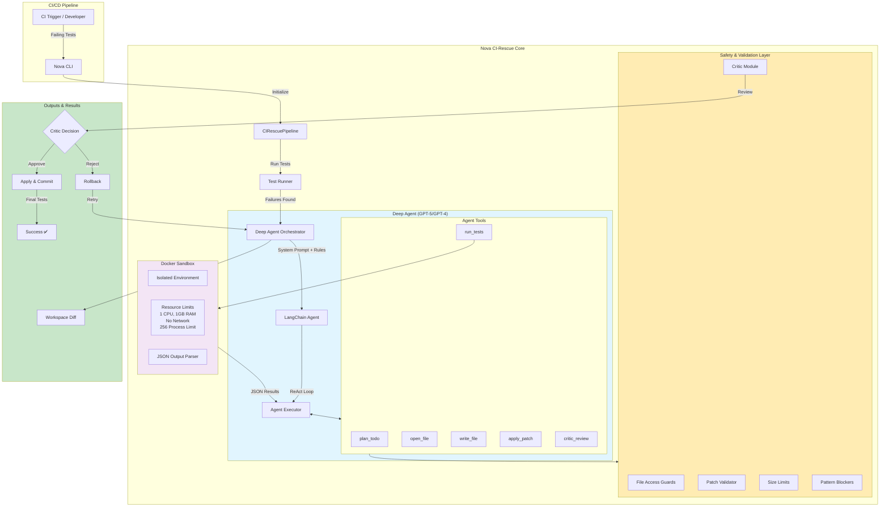

# Nova CI-Rescue Deep Agent Architecture

## System Overview

The Nova CI-Rescue Deep Agent is an advanced AI-powered system that automatically fixes failing tests while strictly adhering to safety guardrails and project policies.

## Architecture Diagram



## Component Details

### 1. **Deep Agent Orchestrator**
- **Model**: Defaults to GPT-5 with fallback to GPT-4
- **Framework**: LangChain with OpenAI function calling
- **Pattern**: ReAct (Reasoning and Acting) loop
- **Context**: Enhanced system prompt with embedded rules

### 2. **Agent Tools**

#### File Operations
- **open_file**: Read source files with path blocking
- **write_file**: Modify source files with safety checks

#### Testing
- **run_tests**: Execute tests in Docker sandbox
- **Returns**: Standardized JSON output

#### Planning & Review
- **plan_todo**: Record fix strategy
- **critic_review**: LLM-based patch review
- **apply_patch**: Apply validated patches

### 3. **Safety Guardrails**

#### File Access Control
```python
BLOCKED_PATTERNS = [
    "tests/*", "test_*.py", "*_test.py",  # Test files
    ".env*", "secrets/*", "*.key",        # Secrets
    ".github/*", "*.yml",                  # CI/CD
    "pyproject.toml", "requirements.txt"   # Dependencies
]
```

#### Patch Limits
- Max 500 lines changed
- Max 10 files modified
- Max 300 additions/deletions

#### Code Pattern Detection
- Blocks dangerous patterns: `exec()`, `eval()`, `os.system()`
- Prevents network operations
- Stops file deletions

### 4. **Docker Sandbox**

#### Resource Limits
- **CPU**: 1.0 core
- **Memory**: 1GB RAM
- **Network**: Disabled
- **Processes**: 256 max
- **Timeout**: 600 seconds

#### Execution Flow
```
Agent -> run_tests -> Docker Container -> JSON Results -> Agent
```

### 5. **Critic Module**

#### Multi-Layer Review
1. **Static Analysis**: Pattern matching for forbidden files
2. **Size Validation**: Ensure patch is minimal
3. **Semantic Review**: LLM evaluation of changes
4. **Safety Verification**: Check for policy violations

#### Decision Flow
```
Patch -> Safety Checks -> LLM Review -> Approve/Reject
```

## Workflow Sequence

### Iteration Cycle
1. **Initialize**: Set up Deep Agent with rules
2. **Analyze**: Understand failing tests
3. **Plan**: Create minimal fix strategy
4. **Implement**: Make targeted changes
5. **Validate**: Critic reviews patch
6. **Test**: Run tests in sandbox
7. **Decision**: Commit or retry

### Success Criteria
- All tests passing
- Patch approved by Critic
- No safety violations
- Minimal diff size

## Key Safety Features

### 1. **Never Modify Tests**
- Hard-coded rule in system prompt
- File pattern blocking
- Critic rejection for test changes

### 2. **Minimal Changes Only**
- Enforced size limits
- Focus on failing tests only
- No refactoring allowed

### 3. **No Tool Hallucination**
- Limited to defined tools only
- OpenAI function calling mode
- No arbitrary code execution

### 4. **JSON Output Standardization**
All tools return structured JSON:
```json
{
  "exit_code": 0,
  "failures": 0,
  "message": "All tests passed",
  "failing_tests": []
}
```

## Configuration

### Model Settings
```python
# config.py
default_llm_model = "gpt-5"  # Primary model
temperature = 0.1             # Low randomness
max_iterations = 6            # Retry limit
```

### Safety Configuration
```python
# SafetyConfig
max_lines_changed = 500
max_files_modified = 10
max_additions = 300
max_deletions = 300
```

## Telemetry & Monitoring

### Event Tracking
- `deep_agent_start`: Initialization
- `deep_agent_success`: All tests pass
- `deep_agent_incomplete`: Partial fix
- `deep_agent_error`: Failure

### Metrics Collected
- Iterations count
- Files modified
- Lines changed
- Execution time
- Success rate

## Error Handling

### Graceful Fallbacks
1. GPT-5 → GPT-4 fallback
2. Docker → Local test runner
3. JSON parsing with error wrapping
4. Timeout protection

### Recovery Strategies
- Automatic rollback on failure
- Iteration limits
- Safe mode activation
- Detailed error logging

## Best Practices

### For Developers
1. Keep test suites focused
2. Provide clear error messages
3. Use consistent code style
4. Document complex logic

### For Operations
1. Monitor iteration counts
2. Review Critic rejections
3. Audit patch history
4. Update blocked patterns

## Future Enhancements

### Planned Features
- Multi-language support
- Parallel test execution
- Advanced code understanding
- Custom rule engines

### Model Evolution
- GPT-5 optimization
- Claude integration
- Local model support
- Specialized fine-tuning

---

*This architecture ensures the Deep Agent operates safely, efficiently, and reliably while maintaining code quality and security standards.*
