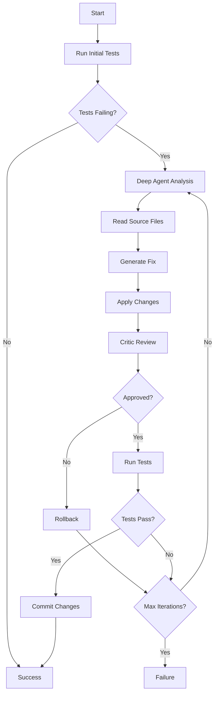

# Nova CI-Rescue Deep Agent

## Overview

Nova CI-Rescue Deep Agent is a LangChain-powered autonomous agent for automatically fixing failing CI tests. It replaces the previous multi-node pipeline with a single, intelligent agent that can plan, read files, write fixes, and run tests autonomously.

## Features

- **Autonomous Test Fixing**: Automatically analyzes and fixes failing tests
- **LangChain Integration**: Powered by OpenAI's GPT-4 with function calling
- **Sandboxed Testing**: Secure Docker-based test execution
- **Smart Code Editing**: Minimal, targeted fixes to source code
- **Safety Guardrails**: Built-in protection against harmful changes
- **Critic Review**: Automated patch review before application

## Installation

### Prerequisites

1. Python 3.10+
2. Docker (for sandboxed test execution)
3. OpenAI API key

### Setup

```bash
# Install dependencies
pip install langchain langchain-openai openai pytest pytest-json-report pytest-timeout

# Set OpenAI API key
export OPENAI_API_KEY='your-api-key-here'

# Build sandbox Docker image
cd src/nova_deep_agent/sandbox
bash build.sh
```

## Usage

### CLI Usage

```bash
# Fix failing tests in current directory
nova-deep fix

# Fix tests in specific repository
nova-deep fix --repo /path/to/repo

# Use specific model and auto-commit fixes
nova-deep fix --model gpt-4 --auto-commit

# Run tests only
nova-deep test --repo /path/to/repo
```

### Programmatic Usage

```python
from nova_deep_agent import DeepAgent
from nova_deep_agent.pipeline import CIRescuePipeline

# Create pipeline
pipeline = CIRescuePipeline(
    auto_commit=True,
    max_iterations=5,
    verbose=True
)

# Run the fix process
results = pipeline.run()

# Check results
if results["status"] == "success":
    print(f"Fixed {results['initial_failing']} failing tests!")
else:
    print(f"Failed to fix all tests: {results['message']}")
```

### Direct Agent Usage

```python
from nova_deep_agent import DeepAgent

# Create agent
agent = DeepAgent()

# Run with custom prompt
prompt = """
Fix the following failing test:
- test_calculator.py::test_add: AssertionError: 5 != 6

Please read the relevant files, identify the bug, and fix it.
"""

result = agent.run(prompt)
print(result)
```

## Architecture

### Components

1. **Deep Agent** (`agent/deep_agent.py`)

   - Core LangChain agent with OpenAI function calling
   - Orchestrates the entire fix process

2. **Agent Tools** (`tools/agent_tools.py`)

   - `plan_todo_tool`: Generate fix plans
   - `open_file_tool`: Read source files
   - `write_file_tool`: Modify source files
   - `run_tests_tool`: Execute tests in sandbox

3. **Sandbox** (`sandbox/`)

   - Docker container for isolated test execution
   - Prevents malicious code execution
   - Returns structured JSON results

4. **Critic** (`pipeline/critic.py`)

   - Reviews patches for safety and effectiveness
   - Enforces size and scope limits
   - Protects critical files

5. **Pipeline** (`pipeline/ci_rescue_integration.py`)
   - Orchestrates the complete workflow
   - Handles iterations and rollbacks
   - Manages git operations

### Flow Diagram



## Configuration

### Agent Configuration

```python
from nova_deep_agent.agent import AgentConfig

config = AgentConfig(
    # Model settings
    model_name="gpt-4",
    temperature=0.0,
    max_tokens=4000,

    # Agent behavior
    verbose=True,
    max_iterations=10,
    max_execution_time=600.0,

    # Safety limits
    max_patch_lines=1000,
    max_affected_files=10,
    max_file_size=100_000,

    # Tool control
    enable_planning=True,
    enable_file_access=True,
    enable_testing=True
)
```

## Safety Features

### Protected Files

The agent cannot modify:

- Configuration files (`setup.py`, `pyproject.toml`, `requirements.txt`)
- Environment files (`.env`)
- CI/CD configurations (`.github/`)
- Git internals (`.git/`)
- Package managers (`poetry.lock`, `Pipfile`)

### Sandbox Isolation

- Tests run in Docker container
- No network access
- Memory and CPU limits
- Timeout protection

### Patch Review

- Size limits (max lines/files)
- Pattern detection for dangerous operations
- Relevance checking against failing tests

## API Reference

### DeepAgent

```python
class DeepAgent:
    def __init__(self, config: Optional[AgentConfig] = None)
    def run(self, user_prompt: str) -> str
    def fix_failing_tests(
        self,
        failing_tests: List[Dict[str, Any]],
        planner_notes: Optional[str] = None
    ) -> Tuple[bool, str, Optional[str]]
    def reset(self)
```

### CIRescuePipeline

```python
class CIRescuePipeline:
    def __init__(
        self,
        agent_config: Optional[AgentConfig] = None,
        max_iterations: int = 5,
        auto_commit: bool = True,
        verbose: bool = True
    )
    def run(
        self,
        initial_test_results: Optional[Dict[str, Any]] = None
    ) -> Dict[str, Any]
```

## Examples

### Basic Fix

```python
from nova_deep_agent.pipeline import CIRescuePipeline

# Simple one-line fix
pipeline = CIRescuePipeline()
results = pipeline.run()
```

### Custom Configuration

```python
from nova_deep_agent import DeepAgent, AgentConfig

config = AgentConfig(
    model_name="gpt-4-turbo-preview",
    temperature=0.1,
    max_iterations=3
)

agent = DeepAgent(config)
result = agent.run("Fix the failing unit tests")
```

### Direct Tool Usage

```python
from nova_deep_agent.tools import (
    plan_todo_tool,
    open_file_tool,
    write_file_tool,
    run_tests_tool
)

# Generate a plan
plan = plan_todo_tool("Calculator tests are failing")

# Read a file
content = open_file_tool("src/calculator.py")

# Write a fix
result = write_file_tool("src/calculator.py", fixed_content)

# Run tests
test_results = run_tests_tool()
```

## Troubleshooting

### Common Issues

1. **"OPENAI_API_KEY not set"**

   ```bash
   export OPENAI_API_KEY='sk-...'
   ```

2. **"Docker command not found"**

   - Install Docker Desktop or Docker Engine
   - Ensure Docker daemon is running

3. **"Sandbox image not found"**

   ```bash
   cd src/nova_deep_agent/sandbox
   bash build.sh
   ```

4. **"Import error: nova_deep_agent not found"**
   ```bash
   pip install -e .
   ```

## Contributing

1. Fork the repository
2. Create a feature branch
3. Make your changes
4. Add tests
5. Submit a pull request

## License

Proprietary - NovaSolve AI

## Support

For issues or questions:

- GitHub Issues: [github.com/novasolve/ci-auto-rescue](https://github.com/novasolve/ci-auto-rescue)
- Email: dev@novasolve.ai
